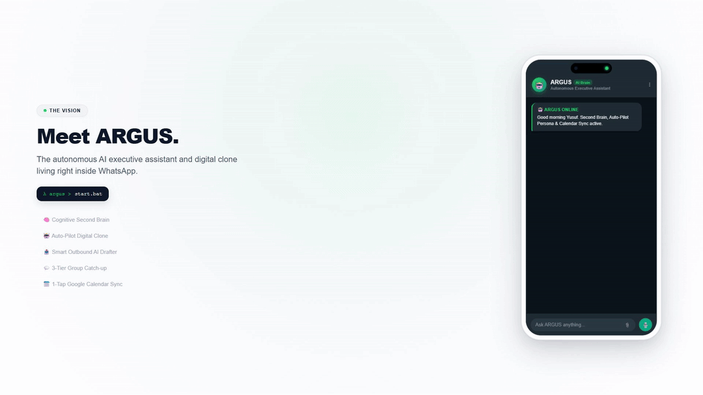

<div align="center">

# 🤖 ARGUS
### **Autonomous Real-time General Utility System**
*Your Personal AI Executive Assistant, Second Brain & Communication Hub on WhatsApp.*

[](LICENSE)
[](https://fastapi.tiangolo.com)
[](https://www.typescriptlang.org/)
[](https://github.com/WhiskeySockets/Baileys)
[](https://groq.com)
[](https://docker.com)

[Features](#-key-features) • [Quickstart](#-quickstart-guide) • [Docker Deployment](#-docker-deployment) • [Command Cheatsheet](#-command-cheatsheet) • [Architecture](#-architecture)

<br/>



</div>

---

## 🌟 Overview

**ARGUS** is a privacy-first, locally hosted AI executive assistant directly integrated into **WhatsApp**. Designed to function as your personal **Second Brain** and digital Chief of Staff, ARGUS actively ingests chatter across all your WhatsApp groups, prioritizes your inbox, schedules calendar events, and drafts polished messages—all controllable via natural conversational WhatsApp messages and voice notes.

```
                     ┌─────────────────────────────────────────┐
                     │          WhatsApp User Interface        │
                     │   (Self-Chat / Dedicated ARGUS Group)   │
                     └────────────────────┬────────────────────┘
                                          │  Baileys (WebSockets)
                                          ▼
                     ┌─────────────────────────────────────────┐
                     │          ARGUS WhatsApp Bridge          │
                     │    TypeScript / SQLite / Cron Worker    │
                     └────────────────────┬────────────────────┘
                                          │  HTTP + HMAC Auth
                                          ▼
┌────────────────────────────────────────────────────────────────────────────────────────┐
│                                    ARGUS AI BRAIN                                      │
│                               (FastAPI + Python Core)                                  │
├────────────────────┬────────────────────┬─────────────────────┬────────────────────────┤
│ 🧠 Second Brain    │ 📬 Gmail IMAP      │ 📅 Google Calendar  │ 🎙️ Groq Whisper        │
│ Auto-Categorizer   │ Direct Reader      │ 1-Tap Link Engine   │ Voice Transcriber      │
├────────────────────┼────────────────────┼─────────────────────┼────────────────────────┤
│ ⚡ Intent Router   │ 💬 3-Tier Catch-up │ 📤 Outbox Drafter   │ 🌐 DuckDuckGo          │
│ & Pre-Filters      │ Conversation AI    │ Interactive Preview │ Real-time Search       │
└────────────────────┴────────────────────┴─────────────────────┴────────────────────────┘
```

---

## ✨ Key Features

### 🧠 1. Cognitive "Second Brain" Memory
* **Auto-Categorization & Tagging:** Say *"remember my SRN is PES1UG25CS001 and I am in Section E"* — ARGUS auto-classifies it under `#academics` with tags `#srn #section`.
* **Conversational Synthesis:** Ask *"what is my SRN and section?"* and ARGUS returns a direct, highlighted answer.
* **Knowledge Dashboard:** Type `memories` or `brain` to view your categorized knowledge graph (🎓 Academics, 👥 People, 🔐 Credentials, 👤 Personal, 💻 Projects).

### 📤 2. Outbound Message Dispatch & AI Drafter
* **Dispatch to Any Group or Contact:** *"Tell noclue I will be 15 minutes late"* or *"Can you send message to Harshith about moving meeting to 7"*.
* **Context-Aware AI Drafting:** ARGUS writes a polite draft adapted to the recipient and sends a WhatsApp preview card.
* **Full Interactive Control:** Reply `yes` (send now), `edit [new text]` (modify draft), or `cancel` (discard).

### 💬 3. All-Chats Ingestion & 3-Tier Catch-up
* **Smart Summaries:** Type `catchup Section E` or `summarize group`.
* **Structured 3-Tier Output:**
  1. 📌 **Key Discussions & Announcements**
  2. 🔗 **Links, Resources & Questions**
  3. ⚡ **Action Items & Deadlines**

### 📬 4. Universal Gmail / IMAP Inbox Reader
* **Inbox Triage:** Type `read my emails` or `emails` to fetch unread emails with sender and subject previews.
* **Executive Breakdown:** Type `summarize email #1` for a deep AI breakdown of any specific email.
* **Inbox Search:** Type `search email invoice` to query your inbox in real time.

### 📅 5. 1-Tap Google Calendar Sync
* **Natural Scheduling:** *"Schedule Hackathon Pitch Presentation tomorrow at 4pm"*.
* **1-Tap Google Calendar Links:** Generates instant Google Calendar add links that sync to your phone and smartwatch with one tap.
* **Schedule Browser:** Type `events` or `calendar` to inspect all upcoming events.

### 🎙️ 6. Groq Whisper Voice Notes
* Speak directly into WhatsApp mic in your `ARGUS` group.
* Voice notes are automatically transcribed via Groq Whisper (`whisper-large-v3`) and executed instantly.

### 🤖 8. Auto-Pilot Digital Clone Persona
* **Autonomous 1-on-1 Auto-Responder:** Turn on auto-pilot for specific contacts or global busy periods (`autopilot on for Harshith` or `autopilot on: studying for exams`).
* **Persona & Tone Matching:** Reads past conversation history and your Second Brain knowledge base to reply in your personal, authentic texting style.
* **Transparent Activity Mirror:** Every auto-pilot response is mirrored back to your `ARGUS` command group in real-time.
* **Realistic Typing Simulation:** Emulates real-world typing indicators (`composing`) with dynamic natural delays.

### 🚫 9. Granular Chat Exemption
* Stop ARGUS from logging spammy chats: `exempt [Group Name]` / `unexempt [Group Name]` / `exempted chats`.

---

## 🚀 Quickstart Guide

### Prerequisites
* **Node.js** v18+ and **npm**
* **Python** v3.10+
* Free **Groq API Key** ([console.groq.com](https://console.groq.com))
* *(Optional)* **Gmail App Password** ([myaccount.google.com/apppasswords](https://myaccount.google.com/apppasswords))

---

### Step 1: Clone Repository & Setup Environments

```bash
git clone https://github.com/your-username/ARGUS.git
cd ARGUS
```

#### Configure Backend Environment:
Copy `backend/.env.example` to `backend/.env`:
```bash
cp backend/.env.example backend/.env
```
Edit `backend/.env`:
```ini
GROQ_API_KEY=gsk_your_actual_groq_api_key
GROQ_MODEL=openai/gpt-oss-120b
ARGUS_SECRET=5f3668d3b40f49f9fc3dc9d02b55b96bc797023b76a327b597900c04aa5ce2ac
EMAIL_USER=your_email@gmail.com
EMAIL_PASS=your_16_character_app_password
```

#### Configure Bridge Environment:
Copy `bridge/.env.example` to `bridge/.env`:
```bash
cp bridge/.env.example bridge/.env
```
Edit `bridge/.env`:
```ini
MY_JID=91XXXXXXXXXX@s.whatsapp.net
AI_BRAIN_URL=http://127.0.0.1:8000
ARGUS_SECRET=5f3668d3b40f49f9fc3dc9d02b55b96bc797023b76a327b597900c04aa5ce2ac
DEDICATED_GROUP_NAME=ARGUS
```

---

### Step 2: Install Dependencies & Build

```bash
# Install Python backend dependencies
cd backend
pip install -r requirements.txt

# Install Node.js bridge dependencies & compile TypeScript
cd ../bridge
npm install
npm run build
cd ..
```

---

### Step 3: Launch ARGUS

#### On Windows:
Double click **`start.bat`** (or run `.\start.bat` in terminal).

#### On macOS / Linux:
```bash
# Terminal 1: Start Backend
cd backend && uvicorn main:app --host 0.0.0.0 --port 8000

# Terminal 2: Start Bridge
cd bridge && npm start
```

---

### Step 4: Link WhatsApp & Create Command Group

1. Scan the **QR Code** displayed in your terminal with WhatsApp (**Settings → Linked Devices → Link a Device**).
2. In WhatsApp, create a new group named **`ARGUS`** (or text your own number in self-chat).
3. Send **`help`** in the group to get started!

> [!TIP]
> **Encountering any connection issues, session glitches, or need a fresh QR code?**
> Run **`fresh_start.bat`** on Windows (or remove `bridge/auth_info/` & `*.db`) to automatically clean session locks, reset local stores, and generate a brand-new QR code instantly!

---

## 🐳 Docker Deployment

Run ARGUS completely containerized with a single command:

```bash
# Build and run both backend and bridge with volume persistence
docker-compose up --build -d

# View the QR code in terminal to link WhatsApp
docker attach argus-bridge
```

* Persistent volumes automatically preserve your WhatsApp credentials (`auth_info/`) and SQLite databases (`argus.db`, `argus_memory.db`).

---

## 📖 Command Cheatsheet

| Category | Command / Natural Language Example | Description |
| :--- | :--- | :--- |
| **🧠 Second Brain** | `remember my SRN is PES1UG25CS001` | Saves & auto-tags personal facts |
| | `what is my SRN?` / `who is Harshith?` | Synthesizes instant direct answers |
| | `memories` / `my brain` | Displays full categorized knowledge base |
| | `forget #1` / `forget wifi password` | Removes outdated facts |
| **📤 Outbound Dispatch** | `tell noclue I'll be 10 minutes late` | AI drafts message & prompts confirmation |
| | `can u send message to Harshith about moving meeting to 7` | Polishes draft, previews card & dispatches |
| | `save contact Harshith 918088421593` | Adds contact to directory |
| | `contacts` | Lists all synced groups and contacts |
| **💬 Group Catch-up** | `summarize group` / `catchup` | Summarizes most active recent chat |
| | `catchup Section E` | 3-tier structured summary of specific chat |
| **📬 Emails (IMAP)** | `read my emails` / `emails` | Fetches recent unread emails |
| | `summarize email #1` | Deep executive breakdown of specific email |
| | `search email invoice` | Queries inbox via IMAP |
| **🤖 Auto-Pilot Persona** | `autopilot on for Harshith` | Auto-replies as you in your voice to that contact |
| | `autopilot on: studying for exams` | Global busy auto-responder for all DMs |
| | `autopilot off` / `autopilot off Harshith` | Disables auto-pilot |
| | `autopilot status` / `autopilot` | Views active auto-pilot rules & stats |
| **📅 Calendar & Events** | `schedule Project Review tomorrow at 4pm` | Generates 1-tap Google Calendar add link |
| | `events` / `calendar` | Views upcoming schedule |
| | `cancel event #1` | Removes event from calendar |
| **📝 Tasks & Reminders** | `todos` / `add buy groceries` / `done #1` | Manages personal todo checklist |
| | `remind me to call Mom in 20 minutes` | Automated WhatsApp reminder notification |
| **🌅 Daily Briefing** | `briefing` / `agenda` | Instant morning/daily executive overview |
| **🚫 Chat Exemption** | `exempt [Group Name]` / `unexempt [Group Name]` | Ignores or un-ignores noisy chats |

---

## 🔒 Security & Privacy

* **Zero Cloud Storage:** All message logs, contact directories, and Second Brain memories are stored exclusively in your local SQLite databases.
* **Airtight `.gitignore`:** All session keys (`auth_info/`), credentials (`.env`), and database files (`*.db`) are strictly excluded from git tracking.
* **Internal Shared Secret:** API communication between the Bridge and AI Brain is secured with an HMAC `X-Argus-Secret` authentication header.

---

## 📜 License

This project is licensed under the **MIT License**. Created with ❤️ by **Yusuf**.
